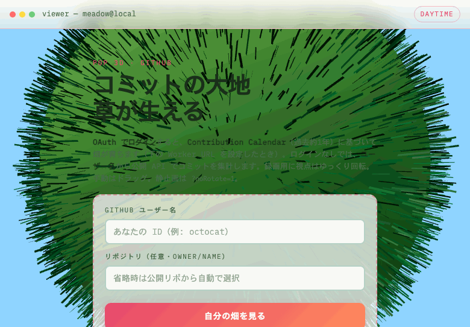
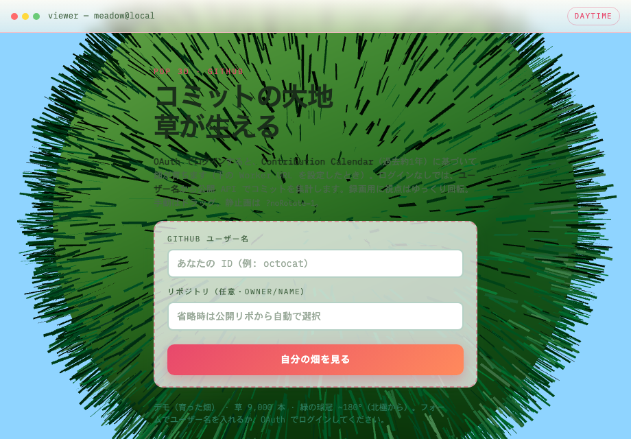

# githubToGallery

自分の GitHub README を更新するためのビジュアル（ヒーロー GIF・3D キャプチャ）と、公開用インタラクティブデモ（**`meadow/`**）をまとめたリポジトリです。リポジトリ名を **`readme-visual-lab`** などへ変えてもよいです（GitHub の Rename。ローカルフォルダ名は `git remote` と揃えると管理しやすいです）。

**移行メモ**: デモのパスは **`night-field/` から `meadow/` に変更**しました。旧 URL のブックマークは切れます。

## ビジュアル方針（日中ポップ × コミット連動）

| 項目 | 内容 |
|------|------|
| **ひと言コンセプト** | **コミットの大地** — コミットが増えるほど土地が広がり、草が生える。 |
| **記憶に残す主役** | **太陽光の下の緑**（明るい半球光＋太陽風ディレクショナル、淡いフォグ）。 |
| **シーン案（採用）** | **`meadow/`** の Three.js フィールド。コミット数で **大地の半径**と**草の本数**が変わる。 |
| **`assets/hero.gif`** | **動きの「ドカン」**：録画用。README 先頭のヒーロー。 |
| **`assets/3d-showcase.png`** | **キービジュアルの静止画**：同シーンのスクリーンショットなど。 |

撮影手順・`ffmpeg` 例は **[meadow/CAPTURE.md](meadow/CAPTURE.md)** を参照。

### GitHub 活動と草（コミット数のみ）

**狙い**: **リポジトリのコミット数**に応じて **土地が広がり草が増える**「畑」を、README / Pages から楽しめるようにする。

**体験（`meadow/` のフォーム）**: **GitHub ユーザー名**を入力して「自分の畑を見る」と、**OAuth なし**で公開 API からデータを取りにいきます。

- **ユーザー名のみ**: 同名リポジトリ（`user/user`）と、公開リポジトリ一覧から最大 **12 件**を試し、**あなたのコミット数が最も多いリポ**を自動選択（[contributors](https://docs.github.com/en/rest/metrics/statistics) の `total`）。  
- **リポジトリも指定**（`owner/name`）: そのリポだけを使い、任意で **`&user=`** により **特定ユーザーのコミット**に限定。  
- **リポジトリだけ**（`?repo=` のみ）: そのリポの **全 contributors 合計コミット**。  
- **OAuth・トークン**: 現状は未使用（将来、非公開活動や正確な contribution カレンダーには GitHub App / Actions が必要）。  
- クエリなし: **デモ用の固定コミット数相当**で小さな大地を表示。  
- 認証なし API には **レート制限**があります。統計が未生成のときは **HTTP 202** でリトライします。

**これから**: GitHub Actions で JSON を生成する、テンプレート化、README 埋め込みなど（[meadow/github-activity.js](meadow/github-activity.js)、[meadow/main.js](meadow/main.js)）。

---

  

  上記は <code>assets/hero.gif</code> を配置すると表示されます（未配置のときはリンク切れに見えます）。

---

## 3D / ビジュアル

  

  <code>assets/3d-showcase.png</code>。静止画の撮り方は <a href="meadow/CAPTURE.md">meadow/CAPTURE.md</a>（<code>?noRotate=1</code> で自動回転オフ）。

---

## デモ（GitHub Pages）

インタラクティブなデモ（日中の大地・コミット連動）はこちら。リポジトリ公開後、**`YOUR_USERNAME` を自分のユーザー名**に置き換えてください。

**[Live demo](https://YOUR_USERNAME.github.io/githubToGallery/meadow/)**

---

## アセットの置き場

| 種類 | 推奨パス | メモ |
|------|-----------|------|
| メイン GIF | `assets/hero.gif` | 幅 920px 前後を目安。[meadow/CAPTURE.md](meadow/CAPTURE.md) |
| 3D キャプチャ | `assets/3d-showcase.png` | PNG / WebP。透明背景が必要なら PNG。 |
| 追加の GIF | `assets/` 任意 | README に `

` を追加。 |

### ハイクオリティにするコツ（事実ベース）

- **GIF**: 録画後、`ffmpeg` や [gifsicle](https://www.lcdf.org/gifsicle/) でパレット最適化・フレーム間引き。
- **解像度**: 横 920〜1280px 程度が README 上で見やすいことが多い。
- **3D**: Three.js のスクリーンショット、または Blender レンダー。

---

## ローカル開発（Pages 用）

`meadow/` が静的サイトです。GitHub の **Settings → Pages** で **Deploy from branch** の **/ (root)** を選ぶと、サブパスとして **`https://<USER>.github.io/<REPO>/meadow/`** で公開されます。

シーンの見た目は **[meadow/main.js](meadow/main.js)**。録画・書き出しは **[meadow/CAPTURE.md](meadow/CAPTURE.md)**。
