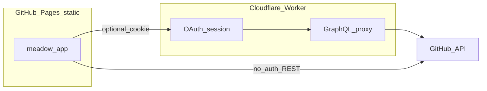

# githubToGallery — プロジェクト説明（エージェント向け）

この文書は、リポジトリを初めて開く開発者・AI エージェントが **何を目的とし、どのディレクトリが何を担い、データがどう流れるか** を短時間で把握するための「地図」です。デプロイ手順の詳細は [README.md](../README.md) および [workers/meadow-auth/README.md](../workers/meadow-auth/README.md) に任せ、ここでは重複を避けます。**実装の現状スナップショットとツール一覧**は [STATUS_AND_TOOLS.md](STATUS_AND_TOOLS.md) を参照。**経緯・現在地・展望**は [HISTORY_AND_OUTLOOK.md](HISTORY_AND_OUTLOOK.md) を参照。**Git / PR 運用**は [.cursor/rules/git-pr-workflow.mdc](../.cursor/rules/git-pr-workflow.mdc) と [AGENTS.md](../AGENTS.md) を参照。

---

## 1. 概要

- **リポジトリ名**: `githubToGallery`（リネームしてもよい。例: `readme-visual-lab`）。
- **一言**: 自分の **GitHub README を飾るビジュアル素材**（ヒーロー GIF・静止画）と、**GitHub の活動量に連動して「畑」が育つ**ブラウザデモをまとめた個人向けプロジェクトです。
- **ホスティング**: 静的ファイルは主に **GitHub Pages**（リポジトリルートまたは `/meadow` サブパス）。OAuth の **client secret は Pages 上に置けない**ため、認可と GraphQL 中継は **Cloudflare Worker**（[`workers/meadow-auth`](../workers/meadow-auth/)）に分離しています。

---

## 2. 解決しようとしていること

| やりたいこと | 実装の向き |
|--------------|------------|
| README 先頭に **大きな GIF / 画像**を置き、リポジトリの印象を強くする | ルート [`assets/`](../assets/) にファイルを置き、ルート [README.md](../README.md) から参照する |
| **活動量**に応じて **3D シーン上の「大地の広さ」と草の量**を変え、リンク先でインタラクティブに見せる | [`meadow/`](../meadow/) の Three.js。数値は「コミット相当」に正規化してスケールに入れる |
| **本物の GitHub アカウント**に紐づく **Contribution Calendar** を使いたい | 任意で Worker + OAuth。未設定なら **公開 REST API だけ**でも動作する |

**非目標（現状）**

- GitHub 公式のホスティング以外への必須依存はない（Worker は任意）。
- 他人のプライベート活動を、本人の同意なしに取得することは設計上の前提にしない（OAuth は **ログイン本人の `viewer`**）。

---

## 3. システム境界

- **静的サイト（`meadow/`）**: HTML/CSS/JS + CDN の Three.js。ブラウザから **GitHub 公開 REST API** を直接叩ける（レート制限あり）。`window.MEADOW_API_BASE` が空なら **OAuth UI は出さない**。
- **Worker（`workers/meadow-auth`）**: OAuth の **authorization code → access token** 交換、**セッション Cookie**、**GraphQL**（`viewer.contributionsCollection`）へのプロキシ。**Client Secret** と **SESSION_SECRET** はここ（Cloudflare Secrets）にのみ置く。

**なぜ Worker が必要か**: GitHub Pages は静的ホストのため、OAuth App の **client secret をフロントに埋め込めない**。そのため「トークンをサーバ側だけで扱う」層が必要。

---

## 4. リポジトリ構成

| パス | 役割 |
|------|------|
| [README.md](../README.md) | ユーザー向けの概要・デプロイ・OAuth 手順・Live demo URL |
| [assets/](../assets/) | README 用 `hero.gif` / `3d-showcase.png` など |
| [meadow/](../meadow/) | **Meadow** デモ: `index.html`、`main.js`（シーン）、`github-activity.js`（公開 API）、`oauth-contributions.js`（Worker 経由の Contribution）、`styles.css`、`CAPTURE.md`（録画手順） |
| [workers/meadow-auth/](../workers/meadow-auth/) | Cloudflare Worker ソース、`wrangler.toml`、Worker 専用 README、`.dev.vars.example` |
| [GITHUB_PROFILE_README.md](../GITHUB_PROFILE_README.md) | プロフィール README 用のテンプレート（任意） |
| [docs/PROJECT.md](PROJECT.md) | 本書（プロジェクト全体の説明） |

---

## 5. データの流れ（スケール）

1. どちらの経路でも、最終的に **1 つの非負の「活動スカラー」**（実装では `commitCount` 相当）を得る。
2. [`meadow/main.js`](../meadow/main.js) がそれを **北極からの球冠の半角 α**（`growthAngleFromActivity`、最大 π で球全体が緑）と **草のインスタンス数**に変換する。**球体**の土壌は `MeshStandardMaterial` の `onBeforeCompile` で茶／緑を混合。ロード時に α と草の表示本数を **イージングで 0→目標**まで伸ばす（ログスケール＋面積・係数はコード内）。

**優先順位（`main.js` の読み込み順）**

1. **`MEADOW_API_BASE` が設定され、かつ Cookie でセッションが有効** → [`oauth-contributions.js`](../meadow/oauth-contributions.js) が `GET /api/contributions` を呼び、GraphQL の **`totalContributions`**（過去約1年）を採用。
2. **上記が使えない** → URL またはフォームのクエリで [`github-activity.js`](../meadow/github-activity.js) が **公開 REST**（contributors 等）から数値を組み立てる。
3. **クエリもない** → デモ用の固定相当値。

---

## 6. データソースの違い（混同しやすい点）

| 経路 | 指標の意味 | 典型の用途 |
|------|------------|------------|
| OAuth + GraphQL | **ログイン中のユーザー本人**の **Contribution Calendar**（`totalContributions` など）。「GitHub がプロフィールで表示する草」と同系の概念。 | 自分の畑を **本番の Contribution** に合わせたい |
| 公開 REST（contributors） | **特定リポジトリ**における **コミットの集計**（`stats/contributors`）。リポジトリ横断の「全体の活動」ではない。 | リポ単位のコミット量を見せたい |
| ユーザー名のみ（自動探索） | 公開リポを走査し、**あなたのコミット数が最大のリポ**を 1 つ選ぶ。 | OAuth なしで手軽に「代表リポ」を当てる |

---

## 7. エージェント向けクイックリファレンス（何を変えると何が変わるか）

| 目的 | 主に触るファイル |
|------|------------------|
| 3D の見た目（照明・草・地面・フォグ） | [meadow/main.js](../meadow/main.js)、[meadow/styles.css](../meadow/styles.css) |
| 活動スカラー → 球冠角・草の本数の式 | [meadow/main.js](../meadow/main.js) 内の `growthAngleFromActivity` / `bladeCountFromCommits` |
| 公開 API の取り方・クエリパラメータ | [meadow/github-activity.js](../meadow/github-activity.js) |
| OAuth 後の Contribution の取り方 | [meadow/oauth-contributions.js](../meadow/oauth-contributions.js) |
| ログイン URL・`MEADOW_API_BASE` | [meadow/index.html](../meadow/index.html) 先頭の `window.MEADOW_API_BASE` とインラインスクリプト |
| OAuth・CORS・GraphQL クエリ | [workers/meadow-auth/src/index.js](../workers/meadow-auth/src/index.js) |
| README 埋め込み SVG カード（テーマ・SVG 生成） | [workers/meadow-auth/src/readme-card.js](../workers/meadow-auth/src/readme-card.js)、`GET /api/readme-card.svg` |
| README 用 GIF の撮り方 | [meadow/CAPTURE.md](../meadow/CAPTURE.md) |
| ルート README のデプロイ・Secrets | [README.md](../README.md) |

---

## 8. 関連ドキュメント

- [AGENTS.md](../AGENTS.md) — エージェント向け索引（**Git/PR 運用**含む）
- [HISTORY_AND_OUTLOOK.md](HISTORY_AND_OUTLOOK.md) — **経緯・現在地・展望**（議論の流れと今後の伸ばしどころ）
- [STATUS_AND_TOOLS.md](STATUS_AND_TOOLS.md) — **現在地**（プレースホルダ・任意拡張）と **ツール一覧**
- [README.md](../README.md) — 利用者向け・Pages ・ OAuth セットアップ手順
- [meadow/CAPTURE.md](../meadow/CAPTURE.md) — 録画・GIF・スクリーンショット
- [workers/meadow-auth/README.md](../workers/meadow-auth/README.md) — Worker のデプロイとローカル開発

---

## 9. セキュリティ（ドキュメントに書かないもの）

OAuth Client Secret、`SESSION_SECRET`、ユーザーのアクセストークンは **リポジトリにコミットしない**。Cloudflare の Secrets / `.dev.vars`（ローカル）に限定する。README カード用の **`GITHUB_TOKEN`**（任意）も同様。
